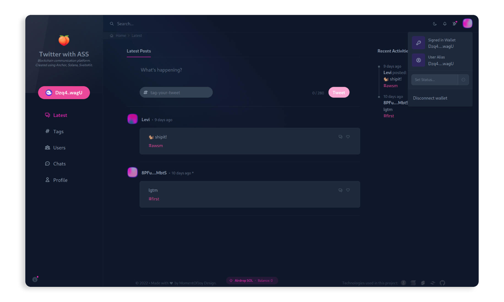

# anchor-solana-twitter

Extends and refactors the v1-branch.

## Major Changes

-  Votings are their own accounts using PDAs, instead of just updating a counter on an existing tweet

   -  enables to filter votings for a user
   -  less costs for sending a vote
   -  the `rating` counter on tweets becomes obsolete, which results in slimmer tweet accounts

-  Direct messages are separate accounts instead of being a tweet

   -  less cost on for dms
   -  `recipient` on tweet account becomes obsolete

-  Comment functionality

-  Users can create aliases

-  New api syntax for tests

   -  abandon deprecated `.rpc` in favor of `.methods` syntax

## Running

The installation of the prerequisites to run an anchor program, is nicely explained in the [anchor book][1].

Having the prerequisites out of the way, the `yarn` command will load some program dependencies.

Building and running the test can be done with `anchor test`.

To use the tests while working on a frontend run the localnet with `anchor localnet`.<br>
In another terminal airdrop your wallet some SOL and load the test `solana airdrop 1000 <YourPhantomWalletPubKey> && anchor run test`.

### Tested Functionalities

```
❯ anchor test                                                                                              

tweets
  ✔ can send and update tweets
  ✔ can send a tweet without a tag
  ✔ cannot send a tweet without content
  ✔ cannot send a tweet with a tag > 50 or content > 280 characters
  ✔ cannot update a tweet without changes
  ✔ can delete own tweets
  ✔ can fetch and filter tweets

comments
  ✔ can comment and update comments
  ✔ can delete comments

votings
  ✔ can vote and update votings
  ✔ can derive tweets from votings

direct messages
  ✔ can send and update dms
  ✔ can delete dms
  ✔ can fetch and filter dms

user alias
  ✔ can create and update a user alias
  ✔ can delete a user alias

status
  ✔ can set a status message with up to 50 characters
  ✔ can delete a status message

reactions
  ✔ can react on tweets and update and delete reactions
  ✔ cannot send other then predefined reactions
```

[1]: https://book.anchor-lang.com/getting_started/installation.html

## Frontend Showcase

To showcase the functionalities of this app you can check out a frontend implementation using SvelteKit on https://twitter-with-ass.vercel.app/ - _WIP_


<a href="https://twitter-with-ass.vercel.app/" target="_blank"></a>
